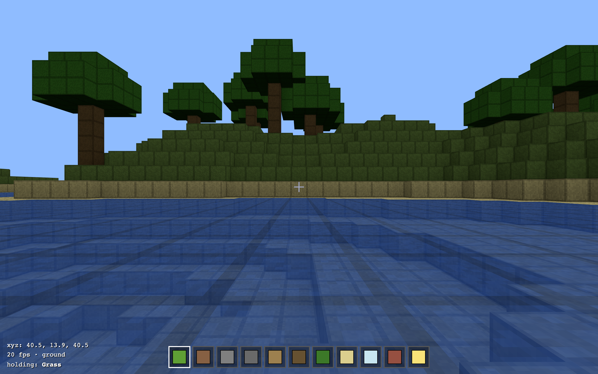

# Minecraft Classic Clone — with a falsifiable test-oracle core

[](https://github.com/PSthelyBlog/minecraft-test-oracle/actions/workflows/ci.yml)
[](https://psthelyblog.github.io/minecraft-test-oracle/)
[](https://dashboard.stryker-mutator.io/reports/github.com/PSthelyBlog/minecraft-test-oracle/main)
[](LICENSE)

A browser voxel sandbox in the spirit of **Minecraft Classic (2009)**: walk around a
bounded blocky world, break and place blocks, fly. Built in TypeScript + Three.js.

The point of this repo isn't only the game — it's that the game's **silent-failure-prone
core** (voxel index math, ray picking, face-culled meshing, terrain generation, AABB
physics, player movement, light propagation) is covered by **independent, per-case, falsifiable oracles**,
scaffolded with the [`test-oracle`](https://github.com/PSthelyBlog/test-oracle) plugin and
proven to actually catch bugs via **mutation testing**.

```bash
npm install
npm run hooks:install  # once — installs the pre-push mutation gate (see below)
npm run dev        # play at http://localhost:5173
npm test           # 115 oracle tests (Vitest + fast-check)
npm run mutation   # StrykerJS — proves the oracles are falsifiable
npm run smoke      # headless-Chromium boot/render check (needs a dev/preview server)
```

The **falsifiability gate runs locally**: `npm run hooks:install` sets up a git `pre-push`
hook that runs `npm run mutation:clean` before any push touching code/tests, aborting it if a
mutant survives (it is too slow — minutes — to gate every PR in CI). CI runs typecheck/test/
build, lint, and the headless render check; the mutation score is published to the badge by a
separate workflow that runs on a published **release** or manual dispatch (not on every merge).
See [docs/TESTING.md](docs/TESTING.md).

**Controls:** click to lock the mouse · `WASD` move · mouse look · `Space` jump ·
`Shift` sneak/descend · left-click break · right-click place · `1–9`/scroll select ·
`F` fly · `N` new world · `Esc` release mouse.

Edits are **saved to your browser** (localStorage) and restored on reload; `N` starts a fresh
world.



## Documentation

| Doc                                          | What's in it                                                                                                                                  |
| -------------------------------------------- | --------------------------------------------------------------------------------------------------------------------------------------------- |
| [docs/ARCHITECTURE.md](docs/ARCHITECTURE.md) | System design, the pure-core/thin-shell split, coordinate & angle conventions, the per-frame data flow, the rendering pipeline, key constants |
| [docs/API.md](docs/API.md)                   | Full reference for every exported symbol in `src/core` and `src/game`, with the invariant each oracle pins                                    |
| [docs/TESTING.md](docs/TESTING.md)           | The oracle methodology, the oracle shapes, what mutation testing found, current scores, equivalent mutants, and how to add an oracle          |
| [docs/EXTENDING.md](docs/EXTENDING.md)       | How-to recipes: add a block, change world size, retune physics, add terrain, textures, chunking                                               |

## Architecture: pure core, thin shell

```
src/core/      pure, dependency-free, oracle-tested logic
  math.ts        3D vectors + camera direction (yaw/pitch → unit vector)
  blocks.ts      block registry: id → {solid, opaque, emission, colour}
  world.ts       fixed-size voxel store; coord↔index is the single source of truth
  raycast.ts     DDA voxel traversal for block picking (break/place)
  mesher.ts      face-culled mesh builder (per-chunk, seam-correct) + greedy merging + UVs
  atlas.ts       tile selection: (block, face) → tile index (= texture-array layer)
  light.ts       block-light + skylight propagation (shared BFS flood-fill)
  water.ts       water flow as a deterministic cellular automaton (level field)
  waterMesh.ts   translucent water surface mesh (the visible water pass)
  terrain.ts     deterministic seeded terrain generation
  physics.ts     AABB vs voxel-grid collision, resolved per axis
  selfcheck.ts   boot self-check: re-derives cheap invariants and THROWS at startup
src/game/
  movement.ts    pure player step: gravity, jump-gating, fly, diagonal normalize
src/render/
  chunkGeometry.ts  uploads the mesher's arrays into a Three.js BufferGeometry
  chunkedTerrain.ts grid of per-chunk meshes; an edit rebuilds only affected chunks
  atlasTexture.ts   procedural block tiles as a DataArrayTexture (one layer per tile)
  terrainMaterial.ts MeshLambertMaterial sampling the tile array by per-vertex layer
src/main.ts      the untestable shell: Three.js, DOM, input, frame loop
```

Everything with real logic is pure and lives under `src/core` / `src/game`, so it can be
tested without a browser. `main.ts` is deliberately thin I/O wiring — it is verified by
the headless **smoke test** (`scripts/smoke.mjs`) rather than a unit oracle.

## The oracle methodology

Each module has a paired `*.test.ts` with oracles chosen for its failure mode — not
"does it return something", but _"what invariant must hold, stated independently of the
implementation?"_. Examples:

- **world** — `index()` must be a **bijection** onto `[0, volume)` (census: no
  collisions, full coverage). Catches any off-by-one or swapped stride.
- **raycast** — an **independent analytic slab/AABB intersection** re-derives the hit
  distance and face from scratch; the DDA must agree, for arbitrary directions.
- **mesher** — face count is checked against an **independent neighbour census**, _and_
  a directional oracle pins that a face is culled by the neighbour in _its own_
  direction (a count-only check can't see that), _and_ a winding oracle verifies each
  quad faces outward.
- **terrain** — a **golden hash** freezes the deterministic output; property tests assert
  the layering contract (bedrock floor, grass/sand surface, stone core, water ≤ sea).
- **physics / movement** — the resolved box is checked against an **independent overlap
  oracle** (not the function under test — that would be self-referential), over a _sparse_
  world so every axis' bounds matter.

### Mutation testing found real problems

Running `npm run mutation` and treating every surviving mutant as a blind spot surfaced,
among others:

- a **real winding bug** — mesh quads were wound clockwise-from-outside, which would make
  every face invisible under default front-face culling (caught by the winding oracle);
- a **self-referential oracle** — physics used `boxIntersectsSolid` to check its own
  output, so a mutated version agreed with itself (fixed with an independent checker);
- a **count-blind oracle** — swapping which neighbour culls which face left the face
  _count_ identical (fixed with a directional oracle);
- **coverage gaps** — the Z-collision branch and player-movement direction were never
  exercised.

Current score: **~95%**. The remaining survivors are documented **equivalent mutants**
(loop bounds that read out-of-bounds → Air with no effect, empty error-message strings,
`1/0 === Infinity` branches, unreachable degenerate-input guards) — the methodology says to
analyse and leave those, not to chase a vanity 100%. Where a survivor encoded an actual
_choice_ — raycast's corner tie-break order, inclusive reach, entry guards — it was pinned
with a golden case instead, so the behaviour is intentional rather than incidental.

Static data (`blocks.ts`) is verified falsifiable by direct injection and excluded from
the mutation _score_ via `ignoreStatic` (Stryker can't activate import-time-constant
mutants with the Vitest runner).

## Plugin commands used

- `/oracle-init` — scaffolded Vitest + fast-check + StrykerJS.
- `/oracle-doctor` — verified wiring and the paired-oracle convention (15/16 modules; the
  exception is the browser entry shell `main.ts`, covered by the smoke test).
- `npm run mutation` (`/oracle-audit`) — the falsifiability proof above.

## License

[MIT](LICENSE) © 2026 PSthelyBlog. This is a fan project inspired by Minecraft Classic; the
MIT license covers this repository's own code and is not affiliated with or endorsed by
Mojang or Microsoft.
